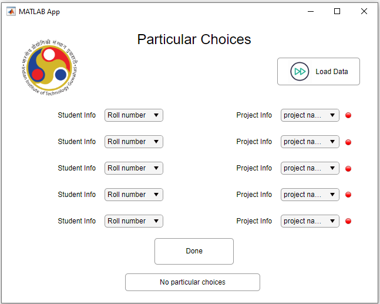

# Project-Allocation

Project-Allocation is an Self Allocation app, where User need to provide just the student choices of the projects and the criteria on which the allotment should be done. This is intentionally developed for Master's students, where the criteria on which the allocation takes place is CGPA. The Graduate Aptitude Test in Engineering (GATE) score can also be taken as a criteria if there is a match in CGPA. However, the GATE score criteria based allocation is not mandatory, user has the choice to allocate the project to a student manually. 

This app also takes care of personal choices by a professor over a student. Initially the app asks the user to allot if any.  

Another Interesting feature in the app is that the user can initially specify maximum number of projects that can be alloted under a specific professor. This way all the professors will have a fair chance of getting a project allocated. By specifying this the code behind the app ensures the allocation satisying the user needs.

# APP Preview

# Specific choices

